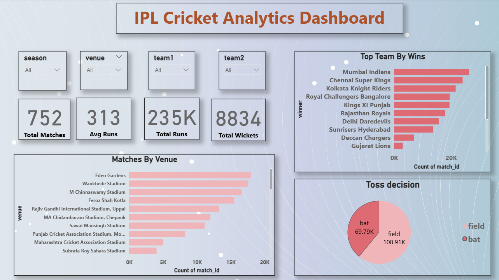
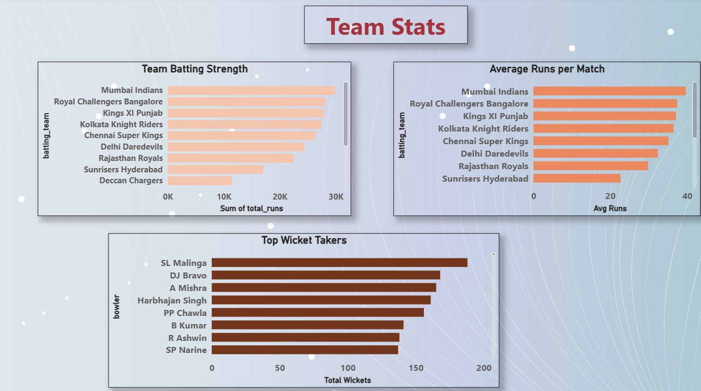
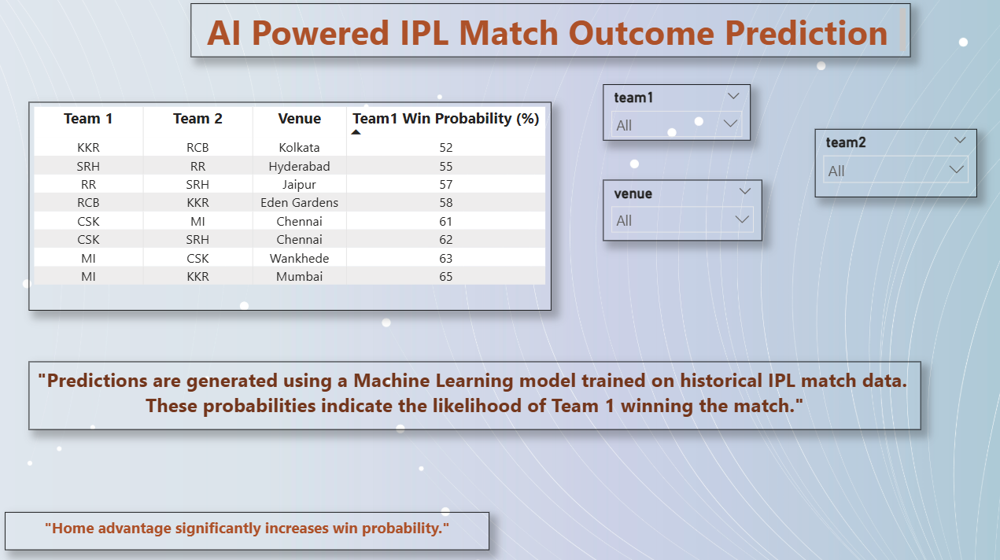

# 🏏 IPL Cricket Analytics & Match Prediction


## 🔥 Key Highlights

- End to End Data Pipeline using Databricks (Bronze → Silver → Gold)
- Machine Learning Model for Match Prediction.
- Interactive Power BI Dashboard.
- MLflow Experiment Tracking.

---

## 📌 Project Overview

This project focuses on analyzing IPL cricket data and predicting match outcomes using Machine Learning. The solution is built using Databricks for data processing and Power BI for visualization.

---

## 🎯 Problem Statement

Predict which team will win a cricket match based on historical match data, team performance and match conditions.

---

## 💼 Business Value

* Helps analysts understand key winning factors.
* Useful for commentators and teams.
* Can be extended for betting analytics and fan engagement.

---

## 🔍 Key Insights

- 🏏 Teams batting first tend to have a slightly higher win probability, indicating the importance of setting a strong target.

- 🏟️ Home advantage plays a role, teams perform better at familiar venues like Wankhede (MI) and Chepauk (CSK).

- 🎯 Toss decision impacts outcome, teams choosing to field first have shown higher success rates in certain conditions.

- 🔥 Top teams like Mumbai Indians and Chennai Super Kings consistently outperform others across seasons.

- 📊 Venue conditions significantly influence match results, making venue a critical feature in prediction.

- 🤖 Machine Learning model (Random Forest) captures complex relationships between teams, venue and match conditions to predict outcomes effectively.

---

## 🏗️ Architecture


---

## ⚙️ Tech Stack

* Databricks (PySpark)
* Python (Machine Learning)
* MLflow (Model Tracking)
* Power BI (Dashboard)
* GitHub (Version Control)

---

## 🔍 Data Understanding & Feature Engineering

- Dataset includes match level and ball by ball data.
- Key features used:
  - Venue (home advantage impact)
  - Toss decision (bat/field influence)
  - Teams (historical performance)
- Data cleaning handled missing and inconsistent values.
- Created structured dataset for ML model.

---

## 🗄️ Delta Lake Implementation

- Implemented Delta tables using Databricks Unity Catalog.
- Converted Silver layer data into Delta format using PySpark.
- Ensures reliable storage with ACID properties.
- Enables scalable and efficient data processing.

Example:

df.write.format("delta").mode("overwrite").saveAsTable("silver_matches_delta")

---

## ⚡ Delta Optimization

- Delta format improves query performance.
- Supports scalable data pipelines in Databricks.

---

## 🔄 Data Pipeline

* Bronze Layer → Raw Data Ingestion
* Silver Layer → Data Cleaning
* Gold Layer → Feature Engineering
* ML Model → Random Forest Classifier
* Silver layer data stored as Delta table for downstream ML and analytics.

---

## 🤖 Model Selection & Technical Reasoning

- Problem Type: Classification
- Model Used: Random Forest Classifier
- Reason:
  - Handles non-linear relationships.
  - Works well with structured data.
  - Robust against overfitting.

---


## 📊 Model Evaluation

- Train Test Split: 80-20
- Metric Used: Accuracy.
- Model Accuracy: ~56%
- Insight: Model performance can improve with better features and tuning.

---

## 🔗 Pipeline Integration

- Data processed through Bronze → Silver → Gold layers
- Gold layer used for model training.
- Predictions generated and visualized in Power BI dashboard.

---

## 📊 Power BI Dashboard

Dashboard provides:

* Team performance analysis.
* Top teams & venues.
* Toss impact.
* Match outcome prediction.

---

## 📊 Dashboard Preview

### 🔹 Overview Dashboard


Provides key KPIs like total matches, runs, wickets and top performing teams.

---

### 🔹 Team Performance Dashboard


Shows batting strength, average runs and top wicket takers.

---

### 🔹 Match Prediction Dashboard


Displays AI based win probability for upcoming matches.

---


## 📁 Project Structure

```
IPL-Cricket-Analytics/
│
├── data/
├── notebooks/
├── powerbi/
├── images/
├── docs/
├── README.md
```

---

## 🚀 How to Run

1. Upload dataset to Databricks (DBFS)
2. Run notebook for Bronze → Silver → Gold transformation
3. Train Machine Learning model.
4. Export processed data as CSV.
5. Open Power BI dashboard (.pbix file)

---

## 👤 Author

Shrimant Moghe
